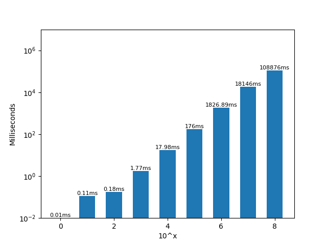
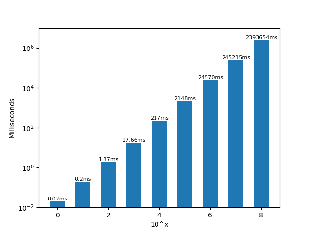
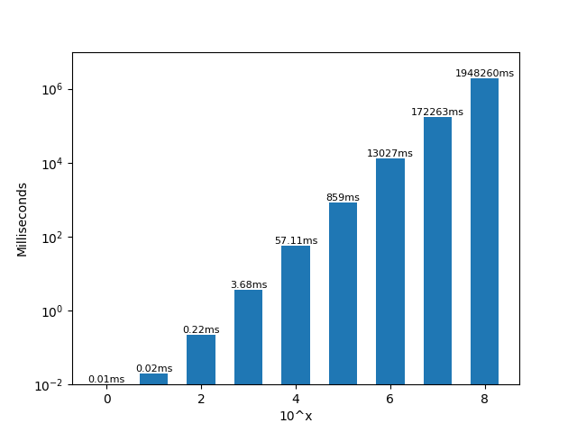
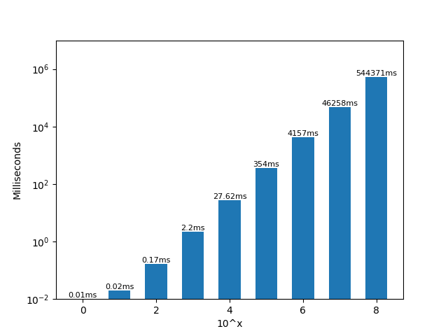
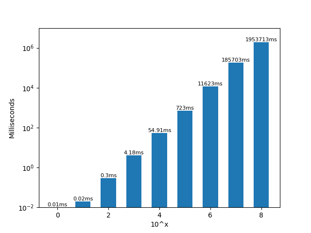
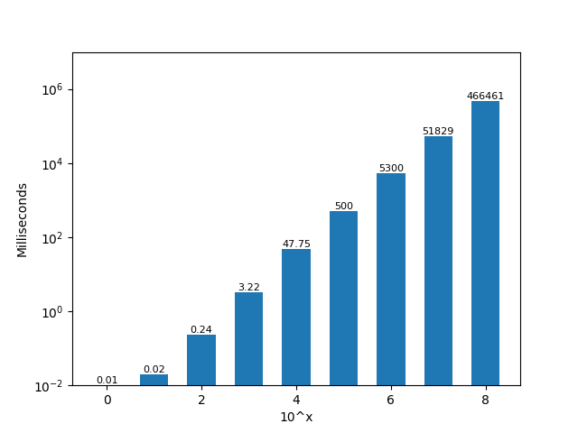
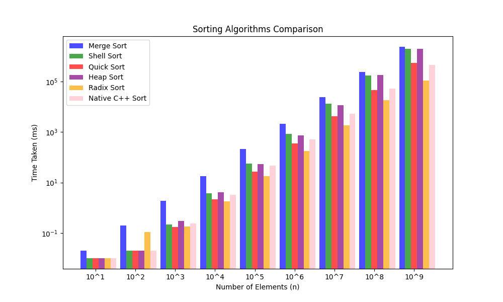

# SD Sortari
##### Corolevschi Mihai - Grupa 232

##### Algoritmii implementati:
1) **Radix Sort**
2) **Merge Sort**
3) **Shell Sort**
4) Quick Sort
5) Heap Sort

##### Statistici dupa testare (Fiecare grafic este logaritmic si a fost generat cu ajutorul librariei matplotlib in Python)
1) Radix Sort



2) Merge Sort



3) Shell Sort



4) Quick Sort



5) Heap Sort



6) Native C++ Sort




## Graficul de comparare



Automat putem observa cateva proprietati:
1) Radix Sort - Este foarte rapid cand e vorba de array-uri de dimensiuni mari, insa putem observa la array-urile de dimensiune cuprinsa intre 10^2 si 10^3 ca merge destul de lent. Totodata suntem limitati de numarul maxim posibil pe care il putem gasi in array.

2) Merge Sort - Foarte lent comparativ cu restul algoritmilor de sortare, insa el este singurul algorithm care is pastreaza tendinta de a fi de complexitate exacta O(N*log(N)). Aceasta proprietate inseamna ca el este destul de bun pentru a sorta arrayuri de dimensiune mare (>10^7).

3) Shell Sort - Il vedem foarte rapid la array-uri destul de mici, insa observam ca devine mai lent odaca cu cresterea dimensiunii array-ului. De asemenea el are tendinta de a ajunge la o complexitate de O(N^2)

4) Quick Sort - Este un algoritm foarte bun de sortare, eficient si rapid. Are o complexitate stabila de O(N*log(N)) si lucreaza foarte bine cu array-uri mari

5) Heap Sort - Il vedem destul de eficient cand e vorba de array-uri mici (<10^6), insa timpul lui de operare creste odata cu cresterea dimensiunii array-ului.

6) Native C++ Sort - Eficient si cu o complexitate stabila in O(N*log(N))

## Cod Sursa

Radix Sort:

```C++
void RadixSort(vector<long long>& a, long long si, long long max) {
    long long contor[10];
    long long ex = 1;

    vector<long long> b;
    b.resize(si);

    while (max / ex > 0) {
        for (long long i = 0; i < 10; i++) {
            contor[i] = 0;
        }
        for (long long i = 0; i < si; i++) {
            contor[(a[i] / ex) % 10]++;
        }
        for (long long i = 1; i < 10; i++) {
            contor[i] += contor[i - 1];
        }
        for (long long i = si - 1; i >= 0; i--) {
            b[contor[(a[i] / ex) % 10] - 1] = a[i];
            contor[(a[i] / ex) % 10]--;
        }
        for (long long i = 0; i < si; i++) {
            a[i] = b[i];
        }
        ex *= 10;
    }
    b.clear();
}
```


Merge Sort:

```C++
void _Merge(vector <long long>& a, long long st, long long mid, long long en) {
    long long lS = mid - st + 1;
    long long rS = en - mid;
    vector<long long> lA;
    vector<long long> rA;
    lA.resize(lS);
    rA.resize(rS);
    for (long long i = 0; i < lS; i++) {
        lA[i] = a[st + i];
    }
    for (long long i = 0; i < rS; i++) {
        rA[i] = a[mid + i + 1];
    }
    long long indexL = 0;
    long long indexR = 0;
    long long indexMain = 0;
    for (indexMain = st; indexL < lS && indexR < rS; indexMain++) {
        if (lA[indexL] < rA[indexR]) {
            a[indexMain] = lA[indexL++];
        }
        else {
            a[indexMain] = rA[indexR++];
        }
    }
    while (indexL < lS) {
        a[indexMain++] = lA[indexL++];
    }
    while (indexR < rS) {
        a[indexMain++] = rA[indexR++];
    }
}
void _MergeSort(vector <long long>& a, long long st, long long en) {
    if (st < en)
    {
        long long mid = st + (en - st) / 2;
        _MergeSort(a, st, mid);
        _MergeSort(a, mid + 1, en);
        _Merge(a, st, mid, en);
    }
}
void MergeSort(vector<long long>& a, long long si, long long max) {
    _MergeSort(a, 0, si - 1);
}
```


Shell Sort:

```C++
void ShellSort(vector<long long>& a, long long si, long long max) {
    for (long long x = si/2; x > 0; x /= 2)
    {
        for (long long i = x; i < si; i += 1)
        {
            long long temp = a[i];
            long long j;
            for (j = i; j >= x && a[j - x] > temp; j -= x)
                a[j] = a[j - x];

            a[j] = temp;
        }
    }
}
```


Quick Sort:

```C++
long long _Partition(vector<long long>& a, long long st, long long en) {
    long long pivot = a[en];
    long long pivotPoint = st;
    for (long long i = st; i < en; i++) {
        if (a[i] < pivot) {
            long long inter = a[i];
            a[i] = a[pivotPoint];
            a[pivotPoint] = inter;
            pivotPoint++;
        }
    }
    long long temp = a[en];
    a[en] = a[pivotPoint];
    a[pivotPoint] = temp;
    return pivotPoint;
}
void _QuickSort(vector<long long>& a, long long st, long long en) {
    if (st < en) {
        long long p = _Partition(a, st, en);        // Pivotarea
        _QuickSort(a, st, p - 1);                   // Partitionarea la stanga
        _QuickSort(a, p + 1, en);                   // Partitionarea la dreapta
    }
}
void QuickSort(vector<long long>& a, long long si, long long max) {
    _QuickSort(a, 0, si - 1);
}
```


Heap Sort:

```C++
void _CreateHeap(vector<long long>& a, long long si, long long pos) {
    long long maxValue = pos;
    long long OuterMost = 2 * pos + 1;
    long long InnerMost = 2 * pos + 2;
    if (OuterMost < si && a[OuterMost] > a[maxValue]) {
        maxValue = OuterMost;
    }
    if (InnerMost < si && a[InnerMost] > a[maxValue]) {
        maxValue = InnerMost;
    }
    if (maxValue != pos) {
        long long inter = a[pos];
        a[pos] = a[maxValue];
        a[maxValue] = inter;

        _CreateHeap(a, si, maxValue);
    }
}
void HeapSort(vector<long long>& a, long long si, long long max) {
    for (long long i = si / 2 - 1; i >= 0; i--) {
        _CreateHeap(a, si, i);
    }
    for (long long i = si - 1; i >= 0; i--) {
        long long inter = a[0];
        a[0] = a[i];
        a[i] = inter;
        _CreateHeap(a, i, 0);
    }
}
```


Main:

```C++
unsigned long long llrand() {
    unsigned long long r = 0;

    for (int i = 0; i < 5; ++i) {
        r = (r << 15) | (rand() & 0x7FFF);
    }

    return r & 0xFFFFFFFFFFFFFFFFULL;
}

bool isSorted(vector<long long>& a, long long si){
    bool ret = true; 
    long long indexFault = -1;
    for (long long i = 0; i < si - 1; i++) {
        if (a[i] > a[i + 1]) {
            ret = false;
            indexFault = i;
            break;
        }
    }
    if (ret == false) {
        for (long long i = 0; i < si ; i++) {
            cout << a[i] << endl;
            if (indexFault == i) {
                cout << "Above Me" << endl;
            }
        }
    }
    return ret;
}

void Sort(vector<long long>& a, long long si, long long max, int sortingAlgorithm) {
    /*
        sortingAlgorithms:  0 = Radix Sort
                            1 = Merge Sort
                            2 = Shell Sort
                            3 = Quick Sort
                            4 = Heap Sort
                            5 = Native C++ Sort
    */
    cout << "   Starting Sorting Algorithm" << endl;
    auto t1 = std::chrono::high_resolution_clock::now();
    if (sortingAlgorithm == 0) {
        RadixSort(a, si, max);
    }
    else if (sortingAlgorithm == 1) {
        MergeSort(a, si, max);
    }
    else if (sortingAlgorithm == 2) {
        ShellSort(a, si, max);
    }
    else if (sortingAlgorithm == 3) {
        QuickSort(a, si, max);
    }
    else if (sortingAlgorithm == 4) {
        HeapSort(a, si, max);
    }
    else if (sortingAlgorithm == 5) {
        sort(a.begin(), a.end());
    }
    auto t2 = std::chrono::high_resolution_clock::now();
    std::chrono::duration<double, std::milli> ms_double = t2 - t1;
    bool s = isSorted(a, si);
    cout << "   Finished Sorting Algorithm" << endl;
    cout << "   Sorted in: " << ms_double.count() << " ms      Status: " << s << "     Array Size: " << si << "\n\n";
}

int main() {
    int putere = 9;
    long long maxValue = 1000000;
    vector<vector<long long>> tests;
    tests.resize(putere);

    cout << "Generating tests" << endl;
    for (int i = 1; i <= putere; i++) {
        for (int j = 0; j < powl(10ll, (long long)i); j++) {
            tests[i - 1].push_back(llrand() % maxValue);
        }
        cout << "   Test 10^" << i << " generated successfully" << endl;
    }


    for (long long i = 0; i < putere; i++) {
        cout << "Running test 10^" << i + 1 << endl;
        Sort(tests[i], tests[i].size(), maxValue, 0);
    }
    
    return 0;
}
```
